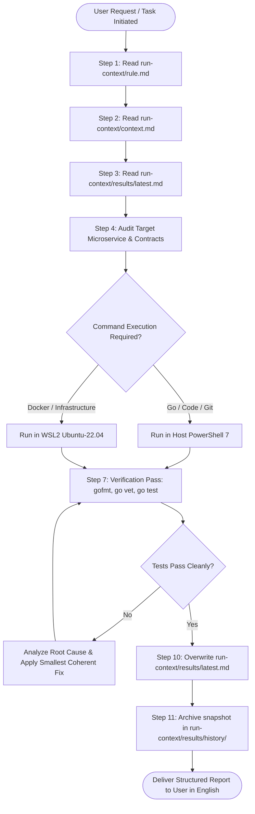

# Run Context Operational Framework (`run-context/`)

> **SYSTEM CLASSIFICATION**: CORE OPERATIONAL MEMORY & GOVERNANCE FRAMEWORK  
> **APPLIES TO**: AI AGENTS, DEVELOPERS, AUTOMATED SCRIPTS, CI/CD PIPELINES  
> **LANGUAGE ENFORCEMENT**: 100% EXCLUSIVE TECHNICAL ENGLISH

---

## 1. Overview & Architectural Purpose

The `run-context/` directory functions as the **authoritative operational memory, execution standard, and governance bridge** for the NexusCommerce microservices platform. It guarantees that any AI Agent or engineer interacting with this repository maintains complete contextual awareness of system boundaries, safe execution practices, and the state of previous execution runs before writing code or running shell commands.

---

## 2. Directory Hierarchy

```text
run-context/
├── README.md               # Master operational manual, architecture sitemap, and agent SOP
├── rule.md                 # Governing rules: English-only doc, safety barriers, layered architecture, WSL2
├── context.md              # Exhaustive technical blueprint: 15 microservices, shared pkg/*, ports, Saga flows
└── results/
    ├── latest.md           # Verbatim audit record of the latest run (MANDATORY reading before any task)
    ├── TEMPLATE.md         # Exhaustive audit reporting template for logging execution cycles
    └── history/            # Immutable historical execution audit logs
        └── 2026-09-14_init.md
```

---

## 3. Mandatory AI Agent Standard Operating Procedure (SOP)

Every interaction requiring code inspection, modification, or terminal execution **MUST STRICTLY COMPLY** with the following lifecycle:



---

## 4. Key Documents Breakdown

### 4.1 [`run-context/rule.md`](file:///c:/Users/nguye/OneDrive/Desktop/Project/FDemo-microservices/run-context/rule.md)
The governing operational rules covering:
- **Strict English-Only Requirement**: Zero-tolerance for non-English documentation, markdown files, logs, commit messages, or code comments.
- **Mandatory Pre-Execution Protocol**: Obligation to review context before touching files or running commands.
- **Strict Layered Boundaries**: Enforcement of `handler -> service -> repository -> domain`. Business logic is prohibited in HTTP handlers.
- **Protobuf & Code Generation**: Hand-editing generated `*.pb.go` is strictly prohibited.
- **Concurrency & Saga Guarantees**: Compensating transactions, distributed locks via Redis Lua, and idempotency key enforcement.
- **Host vs WSL2 Execution Separation**: Running Go commands on Windows host vs Docker Compose in WSL2 Ubuntu-22.04 without detached `-d` flags.

### 4.2 [`run-context/context.md`](file:///c:/Users/nguye/OneDrive/Desktop/Project/FDemo-microservices/run-context/context.md)
The system blueprint detailing:
- **15 Standalone Microservices**: Complete mapping of responsibilities, datastores, endpoints, and internal communication protocols.
- **7 Shared Packages (`pkg/*`)**: `authorization`, `cache`, `customfields`, `idempotency`, `logger`, `messaging`, `saga`.
- **Infrastructure Port Matrix**: Host port mappings (PostgreSQL on `15432`, Redis on `16379`, MinIO API on `9002`, MinIO Console on `9003`, ClickHouse on `9000`/`8123`, Elasticsearch on `9200`).
- **Distributed Workflows**: Sequence diagrams for Checkout Saga, Catalog Ingestion & Search Sync, and Flash Sale Voucher Claims.

### 4.3 [`run-context/results/latest.md`](file:///c:/Users/nguye/OneDrive/Desktop/Project/FDemo-microservices/run-context/results/latest.md)
The active status record detailing:
- Exact commands executed in the previous run.
- Files modified with rationale and impact.
- Static analysis and automated test outcomes.
- Unresolved issues, open regressions, and specific warnings for the subsequent agent.

---

## 5. Verification & Compliance Checklist

Before concluding any session, verify that:
1. All changes remain within the smallest coherent scope.
2. All modified Go files pass `gofmt -w`, `go vet ./...`, and `go test -race ./...`.
3. All documentation is written **100% in professional technical English**.
4. The outcome is recorded in `run-context/results/latest.md` and archived in `run-context/results/history/`.
