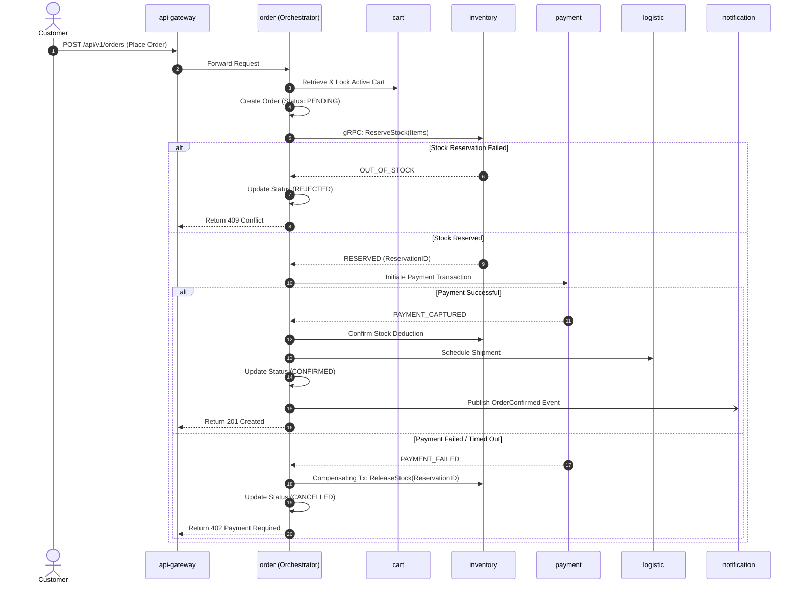

# Technical Architecture Blueprint & System Context

> **DOCUMENT CLASSIFICATION**: REPOSITORY MASTER CONTEXT  
> **PLATFORM**: NexusCommerce Enterprise Distributed Commerce & Fulfillment Platform  
> **STATUS**: VERIFIED OPERATIONAL BASELINE  
> **LANGUAGE REQUIREMENT**: 100% EXCLUSIVE TECHNICAL ENGLISH

---

## 1. Executive Summary & Baseline

NexusCommerce is an enterprise-scale distributed e-commerce backend built with Go (1.22+), containerized infrastructure, and event-driven microservices architecture. It coordinates multi-tenant merchant storefronts, dynamic product catalogs, high-throughput shopping carts, distributed Saga-orchestrated checkout flows, stock reservation systems, multi-gateway payments, fulfillment tracking, and real-time analytical event streaming.

### Core Environment Baseline
- **Primary Host Platform**: Windows 11 (PowerShell 7 / 5.1 host toolchain)
- **Infrastructure Runtime**: Docker Engine 29.3.1 & Docker Compose 5.1.1 running in WSL2 (`Ubuntu-22.04`)
- **Primary Backend Toolchain**: Go `1.22+` (Verified toolchain with Go `1.26.4`)
- **Frontend Target**: Next.js 14+ / TypeScript (Customer Storefront, Seller Portal, Backoffice Admin)
- **Shared Libraries**: 7 internal Go packages in `pkg/*`
- **Microservices Count**: 15 standalone Go service modules

---

## 2. Comprehensive Microservices Inventory

```text
                                  +-----------------------+
                                  |   Client Applications  |
                                  | (Web, Mobile, Seller) |
                                  +-----------+-----------+
                                              |
                                      HTTPS / WSS (Port 8080)
                                              |
                                  +-----------v-----------+
                                  |      api-gateway      |
                                  +---+-------+-------+---+
                                      |       |       |
                 +--------------------+       |       +--------------------+
                 |                            |                            |
       +---------v---------+        +---------v---------+        +---------v---------+
       |       auth        |        |      catalog      |        |       cart        |
       | (PostgreSQL/Redis)|        |   (MongoDB/Redis) |        |    (Redis/Mongo)  |
       +-------------------+        +---------+---------+        +---------+---------+
                                              |                            |
                                      NATS Events / gRPC                   | Checkout
                                              |                            |
       +-------------------+        +---------v---------+        +---------v---------+
       |      search       |        |      review       |        |       order       |
       |  (Elasticsearch)  |        |     (MongoDB)     |        |   (PostgreSQL)    |
       +-------------------+        +-------------------+        +----+----+----+----+
                                                                      |    |    |
                                              +-----------------------+    |    +-----------------------+
                                              | (Saga Orchestration)       |                            |
                                    +---------v---------+        +---------v---------+        +---------v---------+
                                    |     inventory     |        |      payment      |        |     logistic      |
                                    |   (PostgreSQL)    |        |   (PostgreSQL)    |        |   (PostgreSQL)    |
                                    +-------------------+        +---------+---------+        +-------------------+
                                                                           |
                                                             Payment Webhooks / Events
                                                                           |
                                    +--------------------------------------v------------------------------------+
                                    |                        Asynchronous Operations                            |
                                    |  +--------------------+  +--------------------+  +---------------------+  |
                                    |  |      campaign      |  |    notification    |  |      analytic       |  |
                                    |  | (PostgreSQL/Redis) |  | (RabbitMQ/MongoDB) |  |    (ClickHouse)     |  |
                                    |  +--------------------+  +--------------------+  +---------------------+  |
                                    +---------------------------------------------------------------------------+
```

### Detailed Service Specification Matrix

| Microservice | Primary Responsibility | Data Storage & Persistence | Communication & Interfaces | Key Source Paths |
| :--- | :--- | :--- | :--- | :--- |
| **`api-gateway`** | Single public entrypoint, SSL termination, JWT validation, rate limiting, request proxying | Redis 7 (Token blacklist, rate limit buckets) | HTTP/REST, WebSockets (Exposed on `8080`) | `api-gateway/cmd`, `api-gateway/internal/routes` |
| **`auth`** | User authentication, identity lifecycle, OAuth2, RBAC, JWT rotation, session tokens | PostgreSQL 15 (`auth_db` / `identity_db`), Redis | HTTP/REST, gRPC Server, NATS Event Publisher | `auth/cmd`, `auth/internal/service`, `auth/proto` |
| **`profile`** | User profiles, merchant accounts, seller verification, addresses, business data | PostgreSQL 15 (`profile_db`) & MongoDB (`profile_db`) | HTTP/REST, gRPC Server, Event Bus | `profile/cmd`, `profile/internal/domain` |
| **`catalog`** | Product master data, SKU variants, category hierarchy, brands, custom attributes | MongoDB 6.0 (`catalog_db`), Redis (Item cache) | HTTP/REST, gRPC Server, NATS Event Publisher | `catalog/cmd`, `catalog/internal/repository` |
| **`cart`** | High-throughput cart management, session persistence, cart item calculations | Redis 7 (Active cart state), MongoDB (`cart_db` backup) | HTTP/REST, gRPC Client to Catalog/Inventory | `cart/cmd`, `cart/internal/service` |
| **`order`** | Order placement, lifecycle state machine, Saga Orchestrator, transactional outbox | PostgreSQL 15 (`order_db`), Outbox Event Table | HTTP/REST, gRPC Client (Inventory, Payment), NATS/RabbitMQ | `order/cmd`, `order/internal/saga` |
| **`inventory`** | Warehouse inventory tracking, atomic stock reservations, replenishment, safety stock | PostgreSQL 15 (`inventory_db`), Redis (Lua reservation lock) | HTTP/REST, gRPC Server (Order integration) | `inventory/cmd`, `inventory/internal/service` |
| **`payment`** | Multi-gateway abstraction (Stripe, VNPay, MoMo, PayPal), idempotent webhooks, ledger | PostgreSQL 15 (`payment_db`), Redis Idempotency store | HTTP/REST, Public Webhook Handlers, Event Publisher | `payment/cmd`, `payment/internal/handler` |
| **`logistic`** | Shipping calculations, courier integration, tracking updates, dispatch coordination | PostgreSQL 15 (`logistic_db`), Redis Cache | HTTP/REST, Carrier Webhook Handlers, Event Publisher | `logistic/cmd`, `logistic/internal/service` |
| **`campaign`** | Marketing promotions, flash sale campaigns, voucher claim engine, discount validation | PostgreSQL 15 (`campaign_db`), Redis (Lua atomic claim) | HTTP/REST, gRPC Server (Order checkout validation) | `campaign/cmd`, `campaign/internal/repository` |
| **`notification`**| Asynchronous transactional notifications (Email, SMS, FCM push, in-app WebSocket) | MongoDB 6.0 (`notification_db`), RabbitMQ Worker | RabbitMQ Consumer, WebSocket Gateway | `notification/cmd`, `notification/internal/worker` |
| **`analytic`** | Clickstream ingestion, order metrics, seller BI, cohort analysis, event streaming | ClickHouse 23.8 (15 Analytical Tables) | Native TCP (`9000`), HTTP (`8123`), Kafka/RabbitMQ | `analytic/cmd`, `analytic/internal/clickhouse` |
| **`media`** | Object storage integration, presigned S3 upload URLs, image resizing, media variants | MinIO (S3-compatible bucket `nexus-media`) | HTTP/REST, S3 API (Port `9002`), Worker Pipeline | `media/cmd`, `media/internal/storage` |
| **`review`** | Verified buyer product ratings, customer reviews, seller response threads | MongoDB 6.0 (`review_db`), Redis Cache | HTTP/REST, gRPC Client (Order verification) | `review/cmd`, `review/internal/service` |
| **`search`** | Full-text product search, faceted navigation, autocomplete, fuzzy matching | Elasticsearch 8.11 / OpenSearch, Redis | HTTP/REST, NATS Event Consumer (Sync from Catalog) | `search/cmd`, `search/internal/indexer` |

---

## 3. Shared Packages & Common Infrastructure (`pkg/`)

All microservices leverage internal shared packages located in the `pkg/` root directory:
- **`pkg/authorization`**: Role-based access control (RBAC), permission bitmap definitions, JWT claims parsing.
- **`pkg/cache`**: Redis connection pooling, Cache-Aside wrappers, atomic locking patterns (`SET NX EX`), and cache stampede protection.
- **`pkg/customfields`**: Dynamic schema definitions for arbitrary product attributes and order custom metadata.
- **`pkg/idempotency`**: Distributed request deduplication using Redis/PostgreSQL to prevent double-charging or duplicate reservations.
- **`pkg/logger`**: Structured JSON logging powered by Uber Zap / Zerolog with trace propagation.
- **`pkg/messaging`**: High-level abstractions for RabbitMQ and NATS messaging, handling automatic retries, backoff, and dead-letter queues.
- **`pkg/saga`**: Orchestration-based distributed transaction coordinator managing state transitions, execution logs, and compensation hooks.

---

## 4. Infrastructure Networking, Ports & Datastores Matrix

The infrastructure runs via Docker Compose in WSL2 (`Ubuntu-22.04`). Ports are mapped to prevent conflicts with host-native instances:

| Datastore / Component | Container Internal Port | Host Published Port | Compose Service Name | Verification Credentials / Notes |
| :--- | :--- | :--- | :--- | :--- |
| **PostgreSQL 15** | `5432` | **`15432`** | `postgres` | User: `postgres`, Pass: `postgres`. Contains 6 databases: `auth_db`, `profile_db`, `order_db`, `inventory_db`, `payment_db`, `logistic_db`. |
| **Redis 7** | `6379` | **`16379`** | `redis` | No password by default in dev. Key prefix pattern: `database/redis/REDIS_KEY_PATTERNS.md`. |
| **MongoDB 6.0** | `27017` | **`27017`** | `mongodb` | Contains databases: `catalog_db`, `profile_db`, `cart_db`, `review_db`, `notification_db`. |
| **Mongo Express** | `8081` | **`8082`** | `mongo-express` | Web Management UI for MongoDB. |
| **Redis Commander** | `8081` | **`8081`** | `redis-commander` | Web Management UI for Redis instances. |
| **ClickHouse 23.8** | `9000` (Native) / `8123` (HTTP) | **`9000`** / **`8123`** | `clickhouse` | User: `default`, Pass: empty. 15 analytics tables pre-seeded via `database/clickhouse/init.sql`. |
| **MinIO S3** | `9000` (API) / `9001` (Console)| **`9002`** (API) / **`9003`** (Console)| `minio` | Root User: `minioadmin`, Pass: `minioadmin`. Media service connects internally via `minio:9000`. |
| **Elasticsearch 8.11**| `9200` / `9300` | **`9200`** / **`9300`** | `elasticsearch` | Single-node discovery, security disabled for local development. |
| **Kibana 8.11** | `5601` | **`5601`** | `kibana` | Elasticsearch Web Dashboard. |
| **RabbitMQ 3.12** | `5672` (AMQP) / `15672` (Admin) | **`5672`** / **`15672`** | `rabbitmq` | Guest/Guest credentials. Reports EOL warning (upgrade to 3.13+ scheduled). |
| **NATS Core** | `4222` (Client) / `8222` (HTTP) | **`4222`** / **`8222`** | `nats` | High-throughput asynchronous event bus between Go microservices. |

---

## 5. End-to-End Distributed Business Workflows

### 5.1 The Checkout Saga Workflow


### 5.2 Product Catalog Ingestion & Search Sync
1. Merchant modifies product details via `POST /api/v1/catalog/products`.
2. Catalog writes master document to MongoDB `catalog_db` and updates Redis item cache.
3. Catalog publishes `catalog.product.updated` event to NATS.
4. Search service consumes the event, transforms the document, and indexes it in Elasticsearch `products` index.
5. Clients query `GET /api/v1/search?q=...` through API Gateway with sub-second response times.

### 5.3 Flash Sale Voucher Claim (High-Concurrency Lua Engine)
1. User clicks Claim Voucher (`POST /api/v1/campaign/vouchers/{id}/claim`).
2. Campaign service executes Redis Lua script:
   - Validates user has not already claimed the voucher (`SISMEMBER voucher:{id}:users {userId}`).
   - Checks remaining quota (`DECR quota:{id}`).
   - If quota >= 0, adds user to claimed set (`SADD voucher:{id}:users {userId}`).
3. An asynchronous worker persists the claim record into PostgreSQL `campaign_db`.

---

## 6. Development & Operational Scripts

### 6.1 Control Automation (`scripts/fdemo.ps1`)
The repository includes an operational automation script designed for rapid infrastructure lifecycle management:
- **`.\scripts\fdemo.ps1 ON`**: Launches Docker infrastructure in dedicated Windows Terminal tabs with attached output.
- **`.\scripts\fdemo.ps1 OFF`**: Gracefully stops FDemo compose containers while preserving persistent volumes.
- **`.\scripts\fdemo.ps1 STATUS`**: Queries container health, WSL memory allocation, and confirms database readiness.

### 6.2 Service Build & Test Commands
```powershell
# Example: Testing and verifying Order service
cd order
gofmt -w .
go vet ./...
go test -v -race ./...

# Example: Regenerating protobuf contracts
cd order/proto
protoc --go_out=. --go-grpc_out=. *.proto
```
